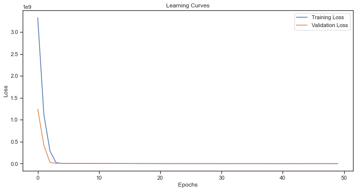

# SOLAR OPTIMIZATION IN NAIROBI


| [](https://numpy.org/) | [](https://pandas.pydata.org/) | [](https://scikit-learn.org/stable/) | [](https://streamlit.io/) |
|---|---|---|---|


# Problem Statement
There is a lack of a systematic approach for harnessing the solar potential of individual buildings in Nairobi. This is exacerbated by multiple unprojected power outages from KPLC, leading to increased interest in alternative energy sources. The primary issues include an absence of precise insights into suitable areas for solar installations and the lack of leveraging a vector dataset containing building footprints in Nairobi.

# Objectives

1. **Rooftop Solar Potential Prediction:**
    - Utilize machine learning techniques to predict suitable rooftop areas, installable capacity, and estimated yearly energy potential for each building unit.
    - Incorporate features such as building type, estimated tilt, and building height in the predictive models.


2. **Optimization Strategies:**
   - Implement algorithms to identify the most efficient rooftop solar installations.
   - Develop strategies for maximizing solar potential while respecting building characteristics.
   - Conduct a basic cost-benefit analysis considering unit installation prices to determine the economic viability of rooftop solar installations for different building types.

3. **User-Friendly Interface:**
   - Develop a user-friendly interface for stakeholders to interact with the system.
   - Enable users to input building characteristics and receive real-time recommendations for optimal rooftop solar installations.


# Data
The data used in this project is from [ NEO](https://energydata.info/dataset/nairobi-rooftop-solar-potential-mapping).
The dataset contains information about building structures and their suitability for solar panel installation. 
Below is a description of the columns in the dataset:
1. **uuid:** Unique ID assigned to each building structure polygon in the dataset.

2. **city:** Indicates the study area or city where the building is located.

3. **Surface_area:**  Represents the surface area of the building, providing spatial information for solar potential assessment.

4. **Potential_installable_area:** Indicates the potential rooftop area suitable for solar panel installation, contributing to the overall solar capacity.

5. **Peak_installable_capacity:** Represents the estimated peak installable capacity based on the suitable rooftop area. This is a crucial factor in determining the potential power generation.

6. **Energy_potential_per_year:** Provides an estimate of the yearly energy potential of the rooftop

7. **Assumed_building_type:** Describes the use type of the building (e.g., single family residential, commercial ).

8. **Estimated_tilt:** Represents the estimated tilt of the rooftop, a significant factor influencing the efficiency of solar panels in capturing sunlight.

9. **Estimated_building_height:** Provides an estimate of the building height, offering additional information about the structure that may impact solar potential.

10. **Estimated_capacity_factor:** The estimated capacity factor is a measure of the efficiency of a solar installation, considering various factors such as available space, structural integrity, shading, and local regulations. It represents the ratio of the actual electrical output over a specific period to the maximum possible output if the system operated at full capacity. A higher capacity factor indicates a more efficient and reliable solar installation.


### Unit Information

    - suitable_area: Square meters (m2)
    - installable_capacity: Kilowatt peak (kWp)
    - potential: Kilowatt-hours (kWh)

**Note:**
    - The dataset is based on GeoEye 1 imagery acquired in 2020.
    - This information allows for the analysis of rooftop solar potential, installable capacity, and estimated yearly power potential for each building in the study area.

# Modelling and Evaluation
### Energy Potential Per Year. 
This represents the estimated amount of solar energy that can be generated annually by the installation of solar panels on the given surface area.      
In this phase we explore two prominent ensemble learning algorithms known for their robustness to multicollinearity ; `Random Forest` and `eXtreme Gradient Boosting`.     
Additionally, we experiment with a` Neural Network` approach to further analyze and predict solar energy generation potential.    

After thorough evaluation, we determined the `Neural Network` as our final model. While the tuned XGBoost model demonstrates commendable performance, the Neural Network model excels in accuracy across both training and testing datasets. This underscores the Neural Network's superior predictive prowess, hence our selection. 

Below is the final model's learning curve: 



The proximity and stability of both curves suggest minimal overfitting or underfitting, indicating a robust model.

### Potential Installable Area
Here,  we try and predict the potential installable  area based on critical factors such as "Surface Area", "Estimated tilt", and "Estimated building height" .     
We explore the `Random Forest` algorithm and run a `Grid Search` on the same to optimize the model parameters. 

# Deployment and UI
`Joblib`: Used to deploy the machine learning algorithms.         
`Streamlit`: Used to create the interactive data app.         


To run the streamlit app locally, run the following:

```sh
streamlit run deployment/app.py
```
# Next Steps


# Acknowledgement
* [Sammy Kimani](https://github.com/samcurryokee)        
* [Esther Nyawera](https://github.com/ENyawera)          
* [Allen Maina](https://github.com/murayaallen)        
* [Mumbi Odhiambo](https://github.com/Mumbsss)          
* [Lucy Waruguru](https://github.com/WacekeW)          
* [Timothy Lenku](https://github.com/esipil)              